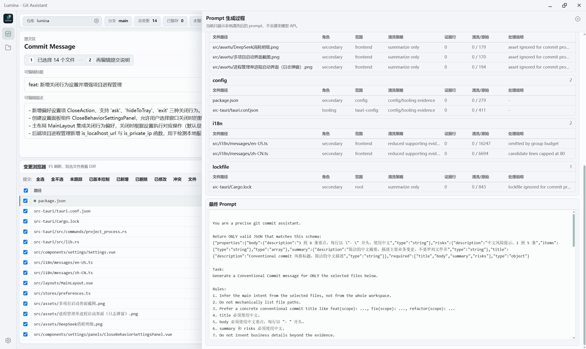
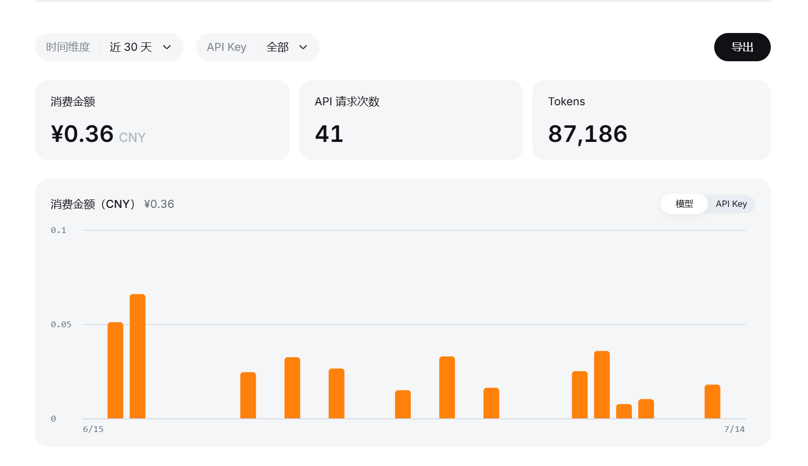
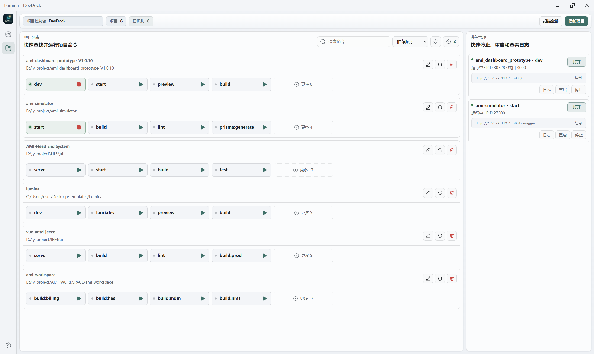
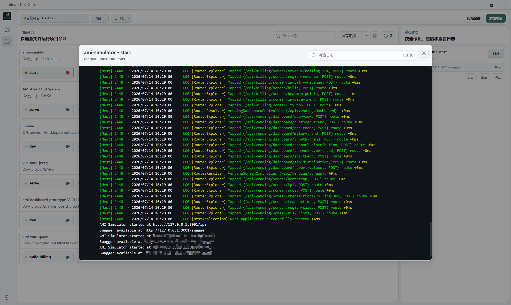

# Lumina

[English](#english) · [下载与发布](https://github.com/zhkai-ybwn/Lumina/releases) · [反馈问题](https://github.com/zhkai-ybwn/Lumina/issues/new/choose)

Lumina 是一个给多项目开发者使用的本地桌面工作台：用低成本模型生成 Git Commit Message，并在一个窗口内启动、停止和查看多个项目进程。

> 不必为一次提交说明消耗紧张的编码模型 Token，也不必在 Git Bash、CMD 和 VS Code 终端之间来回找项目。

## 为什么做它

日常开发里有两个重复、但不值得占用大量注意力的任务：

1. 根据已选文件写一条可靠的 Commit Message。让通用编码模型反复处理它，成本并不划算。
2. 同时维护多个前端项目时，开发服务散落在多个终端窗口，启动、停止、日志和端口状态都难追踪。

Lumina 把这两件事放到同一个本地桌面应用里。AI 只辅助提交信息生成；进程仍由你明确选择的 `package.json` scripts 启动和控制。

## 两个核心工作流

### 低成本 AI Commit

选择本次要提交的文件，Lumina 会生成可编辑的 Conventional Commit 标题与正文；你仍然可以检查 Prompt、修改结果，再完成提交。



支持 Ollama 与 OpenAI-compatible API，可配置 DeepSeek 等兼容服务。Prompt 按选中文件构建，并提供处理过程查看，避免把无关工作区内容直接发送给模型。

下面是开发期间同一 API Key 的近 30 天用量样本：41 次请求共 ¥0.36，约 ¥0.0088 / 次请求。费用会随模型、输入和输出长度变化；这不是对所有使用场景的价格承诺。



### DevDock：多项目进程管理

DevDock 读取项目的 `package.json` scripts，集中展示并运行多个项目。你可以查看运行状态、PID、端口、可访问地址和日志，并随时停止或重启受管进程。



日志直接在 Lumina 内查看，不需要在一堆终端窗口中定位对应服务。



## 功能一览

| Git 工作台                           | AI Commit Assistant              | DevDock                   |
| ------------------------------------ | -------------------------------- | ------------------------- |
| 文件 Diff、暂存状态和提交历史        | 生成并编辑 Conventional Commit   | 解析并运行项目 scripts    |
| Fetch、Pull、Push、Rebase 与冲突辅助 | OpenAI-compatible 与 Ollama 模型 | 启动、停止、重启受管进程  |
| 选择部分文件提交，保留其他暂存状态   | Prompt 预览、处理过程与生成记录  | PID、端口、URL 和实时日志 |

## 安装与试用

### 下载桌面安装包

前往 [Releases](https://github.com/zhkai-ybwn/Lumina/releases) 下载已发布的安装包。当前仍处于公开测试阶段，欢迎通过 [Issue](https://github.com/zhkai-ybwn/Lumina/issues/new/choose) 提交使用反馈。

### 从源码运行

环境要求：Node.js 20+、Rust 1.77.2+、Git，以及 [Tauri 2 系统依赖](https://v2.tauri.app/start/prerequisites/)。

```bash
git clone https://github.com/zhkai-ybwn/Lumina.git
cd Lumina
npm install
npm run tauri:dev
```

构建安装包：

```bash
npm run tauri:build
```

构建产物位于 `src-tauri/target/release/bundle/`。Windows 下如果 NSIS 或 WiX 下载失败，可运行：

```powershell
powershell -ExecutionPolicy Bypass -File fix-tauri-tools.ps1
```

## 配置 AI 模型

打开 **设置 → 模型**，添加模型后先测试连接，再为 Commit Message 等任务选择模型。

- **OpenAI-compatible**：填写服务地址、模型名和 API Key；可用于 DeepSeek 等兼容 `/chat/completions` 的服务。
- **Ollama**：例如 `http://localhost:11434`，适合完全本地的模型工作流。

使用远程模型时，选中的代码变更和生成 Prompt 会发送给你配置的服务提供方。请只对你有权限发送的代码使用远程服务。

## 数据与安全边界

- 模型配置、最近仓库、主题和提交记录保存在本机应用数据中。
- 项目画像与 Prompt 调试数据写入项目内的 `.lumina/`，Lumina 不会自动提交该目录。
- DevDock 会执行你主动选择项目中的 `package.json` scripts；请只添加可信项目目录。
- 退出时可选择最小化到系统托盘，或停止全部受管进程后退出。

## 反馈与贡献

Lumina 现在最需要的是实际工作流反馈，尤其是：

- 你是否会用低成本模型替代编码模型生成 Commit Message？
- 你通常会同时运行多少个本地项目？
- 你最希望 DevDock 优先解决“项目组启动”“进程健康检查”还是“成本统计”？

请使用 [Bug 报告](https://github.com/zhkai-ybwn/Lumina/issues/new/choose) 或 [功能建议](https://github.com/zhkai-ybwn/Lumina/issues/new/choose) 模板。欢迎提交 Pull Request，详细流程见 [贡献指南](CONTRIBUTING.md)。

开发前的本地检查：

```bash
npm run lint
cargo test --manifest-path src-tauri/Cargo.toml --lib
```

## License

[MIT](LICENSE)

---

<a id="english"></a>

# Lumina

[中文](#lumina) · [Releases](https://github.com/zhkai-ybwn/Lumina/releases) · [Report an issue](https://github.com/zhkai-ybwn/Lumina/issues/new/choose)

Lumina is a local desktop workbench for developers who manage multiple projects: generate Git commit messages with cost-effective AI models, then start, stop, and inspect local project processes in one place.

## Why Lumina

Two routine tasks become distracting when repeated every day:

1. Writing a reliable commit message from selected changes should not consume a costly coding-model budget.
2. Running several local projects should not mean hunting through Git Bash, CMD, and VS Code terminals for the right service.

Lumina keeps both workflows local and explicit. AI assists with commit messages; DevDock only runs the `package.json` scripts you choose.

## Core workflows

### Cost-conscious AI Commit

Select the files for a commit, generate an editable Conventional Commit title and body, review the prompt, then commit.


Lumina supports Ollama and OpenAI-compatible APIs, including compatible DeepSeek services. Prompts are built from selected files and can be inspected before model use.

### DevDock for local projects

DevDock reads `package.json` scripts and brings multiple projects, their processes, ports, URLs, and logs into one view.


## Install

Download a published installer from [Releases](https://github.com/zhkai-ybwn/Lumina/releases), or run from source with Node.js 20+, Rust 1.77.2+, Git, and the [Tauri 2 prerequisites](https://v2.tauri.app/start/prerequisites/):

```bash
git clone https://github.com/zhkai-ybwn/Lumina.git
cd Lumina
npm install
npm run tauri:dev
```

Build an installer with `npm run tauri:build`.

## AI and data boundary

- Configure OpenAI-compatible or Ollama models in **Settings → Models**.
- When you use a remote provider, selected code changes and the generated prompt are sent to that provider.
- AI configuration, recent repositories, themes, and commit history stay in local application data.
- DevDock only executes scripts from project directories you explicitly choose.

## Feedback and contribution

Lumina is in public beta. Please report bugs and feature ideas through [GitHub Issues](https://github.com/zhkai-ybwn/Lumina/issues/new/choose), and see [CONTRIBUTING.md](CONTRIBUTING.md) before opening a pull request.

## License

[MIT](LICENSE)
